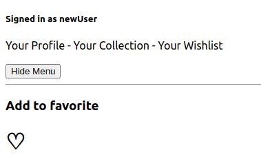
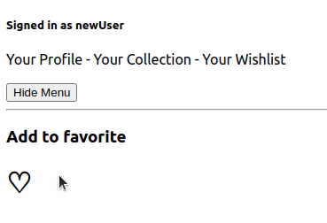
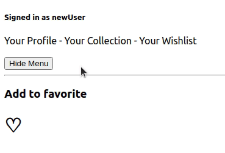

- Higher-Order Components (Компоненты высшего порядка, HOC) позволяют повторно использовать код компонентов.
- Компонент высшего порядка представляет собой функцию, которая принимает компонент, как аргумент, затем преобразует этот компонент в другой компонент, наделяя его какими либо новыми способностями, и затем возвращает новый компонент.

В этой статье мы разберем, чем полезны компоненты высшего порядка, и как их создавать.

Идея компонентов высшего порядка берет свое начало из концепта функций высшего порядка (Higher-Order functions). <br />
Функция высшего порядка - это функция, которая принимает другую функцию как аргумент. Часто этот аргумент называется коллбэком (обратный вызов, callback) и он вызывается после совершения каких то других действий.

Пример функций высшего порядка - это некоторые методы массивов, такие как .filter(), .map(), .reduce(). Разница между этими тремя методами и другими методами, такими как .pop(), .push(), или .shift() заключается в том, что filter, map и reduce, принимают функции как аргументы.

Так вот, компонент высшего порядка в React - это функция, которая принимает какой то другой компонент, и возвращает новый компонент, и предоставляет ему какие то новые дополнительные возможности.

```js
const EnhancedComponent = higherOrderComponent(WrappedComponent)
```

_Разберем пример использования компонентов высшего порядка ниже_

Есть простое приложение, вот его UI:



Вот так выглядит App.js:

```jsx file=src/App.js highlights=8,10
import Menu from "./Menu"
import Favorite from "./Favorite"

function App() {
  return (
    <div className="App">
      <div>
        <Menu />
        <hr />
        <Favorite />
      </div>
    </div>
  )
}

export default App
```

**App** рендерит два компонента, **Menu** и **Favorite**.

Рассмотрим, как устроены эти компоненты. Начнем с Favorite:

```jsx file=src/Favorite.js highlights=4-6
import { useState } from "react"

function Favorite() {
  const [isFavorited, setIsFavorited] = useState(false)

  const toggleFavorite = () => setIsFavorited((prevState) => !prevState)

  return (
    <div>
      <h3>Add to favorite</h3>
      <h1>
        <span onClick={toggleFavorite} style={{ cursor: "pointer" }}>
          {isFavorited ? "❤️" : "♡"}
        </span>
      </h1>
    </div>
  )
}

export default Favorite
```

Что у нас здесь происходит?

Этот компонент рендерит сердечко. Когда мы кликаем на сердце, оно становится красным, или наоборот, прозрачным. Как будто мы ставим лайк.

Как это работает?

**Favorite** - это stateful компонент, то есть компонент, у которого есть стейт, или состояние.
В примере выше часть кода, отвечающая за стейт, подсвечена. У стейта в нашем случае может быть два состояния, false, и true.

Этот стейт отвечает за сердечко. Когда мы нажимаем на сердце, при клике срабатывает функция toggleFavorite, эта функция меняет стейт isFavorited с false на true, или наоборот. Если компонент видит, что isFavorited = false, отрендерится пустое сердце, а если isFavorited = true, отрендерится красное сердце.



Теперь посмотрим компонент **Menu**.

```jsx file=src/Menu.js highlights=4-6
import { useState } from "react"

function Menu() {
  const [showMenu, setShowMenu] = useState(true)

  const toggleShow = () => setShowMenu((prevState) => !prevState)

  return (
    <div>
      <nav style={{ display: showMenu ? "block" : "none" }}>
        <h5>Signed in as newUser</h5>
        <a> Your Profile </a>
        <a> - Your Collection </a>
        <a> - Your Wishlist </a>
      </nav>
      <br />
      <button type="button" onClick={toggleShow} style={{ cursor: "pointer" }}>
        {showMenu ? "Hide" : "Show"} Menu
      </button>
    </div>
  )
}

export default Menu
```

**Menu** использует похожую логику, что и **Favorite**. Когда мы нажимаем на кнопку, меню или показывается, или скрывается.



Как мы можем использовать этот функционал повторно? В этом нам помогут компоненты высшего порядка.
Создадим новую папку HOCs, и в ней создадим новый файл, higherOrderComponent.js

```jsx file=src/HOCs/higherOrderComponent.js highlights=7-11
import { useState } from "react"
// Компонент высшего порядка - это функция, которая принимает компонент как аргумент,
// и возвращает новый компонент, давая ему какие то новые возможности

const higherOrderComponent = (WrappedComponent) => {
  const Component = (props) => {
    const [on, setOn] = useState(false)

    const toggle = () => {
      setOn((prevState) => !prevState)
    }
    // if any props are passed alone, we should include them with {...props}
    return <WrappedComponent on={on} toggle={toggle} {...props} />
  }

  return Component
}

export default higherOrderComponent
```

Как тут все работает?

- Есть компонент higherOrderComponent, это компонент высшего порядка.
- Этот компонент принимает другой компонент как аргумент.
- Внутри компонента высшего порядка мы указываем какой то функционал, который нужно дать компоненту, который мы передаем.(в нашем случае это подсвеченные строки)
- Далее мы передаем необходимый функционал как пропсы, и возвращаем новый компонент.

Как теперь мы можем использовать данный компонент высшего порядка, чтобы убрать из других наших компонентов повторяющуюся логику?

Посмотрим пример ниже. Вот наш обновленный компонент **Favorite**:

```jsx file=src/Favorite.js
import higherOrderComponent from "./HOCs/higherOrderComponent"

function Favorite({ toggle, on }) {
  return (
    <div>
      <h3>Add to favorite</h3>
      <h1>
        <span onClick={toggle} style={{ cursor: "pointer" }}>
          {on ? "❤️" : "♡"}
        </span>
      </h1>
    </div>
  )
}

const EnhancedFavoriteComponent = higherOrderComponent(Favorite)
export default EnhancedFavoriteComponent
```

Мы убрали из **Favorite** логику, которая отвечала за переключение сердечка, теперь эта логика находится в higherOrderComponent.js.
**Favorite** теперь получает функцию _toggle_ как пропсы, а за переключение сердца с красного на прозрачное отвечает теперь не isFavorited, а boolean _on_ который передается компоненту **Favorite** так же из пропсов.

Теперь давайте посмотрим на компонент **Menu**:

```jsx file=src/Menu.js
import higherOrderComponent from "./HOCs/higherOrderComponent"

function Menu({ toggle, on }) {
  return (
    <div>
      <nav style={{ display: on ? "block" : "none" }}>
        <h5>Signed in as newUser</h5>
        <a> Your Profile </a>
        <a> - Your Collection </a>
        <a> - Your Wishlist </a>
      </nav>
      <br />
      <button type="button" onClick={toggle} style={{ cursor: "pointer" }}>
        {on ? "Hide" : "Show"} Menu
      </button>
    </div>
  )
}

export default higherOrderComponent(Menu)
```

Здесь все сделано по аналогии с **Favorite**

Правда появилась небольшая проблема, по умолчанию меню теперь закрыто, потому что в компоненте высшего порядка у нас стейт по умолчанию установлен в false:

```jsx file=src/HOCs/higherOrderComponent.js highlights=7
import { useState } from "react"
// Компонент высшего порядка - это функция, которая принимает компонент как аргумент,
// и возвращает новый компонент, давая ему какие то новые возможности

const higherOrderComponent = (WrappedComponent) => {
  const Component = (props) => {
    const [on, setOn] = useState(false)

    const toggle = () => {
      setOn((prevState) => !prevState)
    }
    // if any props are passed alone, we should include them with {...props}
    return <WrappedComponent on={on} toggle={toggle} {...props} />
  }

  return Component
}

export default higherOrderComponent
```

нам нужно немного изменить наш компонент высшего порядка, чтобы у нас была возможность передавать с пропсами требуемое значение стейта, true, или false:

```jsx file=src/HOCs/higherOrderComponent.js highlights=3,5,15
import { useState } from "react"

const higherOrderComponent = (WrappedComponent, optionsObj) => {
  const Component = (props) => {
    const [on, setOn] = useState(optionsObj.defaultOnValue)

    const toggle = () => {
      setOn((prevState) => !prevState)
    }
    // if any props are passed alone, we should include them with {...props}
    return (
      <WrappedComponent
        on={on}
        toggle={toggle}
        defaultOnValue={optionsObj.defaultOnValue}
        {...props}
      />
    )
  }

  return Component
}

export default higherOrderComponent
```

Теперь мы можем передать с пропсами false, для компонента **Favorite**:

```jsx file=src/Favorite.js highlights=16,17,18
import higherOrderComponent from "./HOCs/higherOrderComponent"

function Favorite({ toggle, on }) {
  return (
    <div>
      <h3>Add to favorite</h3>
      <h1>
        <span onClick={toggle} style={{ cursor: "pointer" }}>
          {on ? "❤️" : "♡"}
        </span>
      </h1>
    </div>
  )
}

const EnhancedFavoriteComponent = higherOrderComponent(Favorite, {
  defaultOnValue: false,
})
export default EnhancedFavoriteComponent
```

Таким образом сердце изначально будет прозрачным, а не красным. <br />
Для компонента **Menu** передадим true, чтобы меню по-умолчанию было развернуто:

```jsx file=src/Menu.js highlights=20
import higherOrderComponent from "./HOCs/higherOrderComponent"

function Menu({ toggle, on }) {
  return (
    <div>
      <nav style={{ display: on ? "block" : "none" }}>
        <h5>Signed in as newUser</h5>
        <a> Your Profile </a>
        <a> - Your Collection </a>
        <a> - Your Wishlist </a>
      </nav>
      <br />
      <button type="button" onClick={toggle} style={{ cursor: "pointer" }}>
        {on ? "Hide" : "Show"} Menu
      </button>
    </div>
  )
}

export default higherOrderComponent(Menu, { defaultOnValue: true })
```
