В этом конспекте я попытаюсь разобраться в основах JavaScript.

Сначала буду отвечать на такие вопросы, как:

- что происходит, когда когда браузер читает код, который мы написали в VSCode, как браузер читает этот файл?
- как выполняется JavaScript?
- как работает Node.js?

Если кто то спросит меня, "слушай, а можешь объяснить, как работает JavaScript, как пятилетнему ребенку?", к концу этого конспекта, я должен суметь ответить на этот вопросы, и на многие другие. Объяснить все простыми словами, так, как я это сам понимаю.

## Part 1: JavaScript Engine (Движок JavaScript)

Как мы обычно пишем код? Мы открываем наш любимый редактор и пишем код:

```js file=/some-javascript-file.js
const isLearning = true
```

Нам тут все понятно, мы объявили константу isLearning, и присвоили ей значение true.
Но как сам компьютер понимает, что мы тут написали?

Компьютер понимает только единицы и нули, поэтому если мы дадим ему наш .js файл, он посмотрит на него, и не поймет ровным счетом ничего.
Он не понимает в принципе, что такое JavaScript. Компьютер понимает только 1 и 0, это его родной язык.

Каким тогда образом мы можем объяснить компьютеру, а что это вообще такое, этот JavaScript?

**Для этого нам нужен JavaScript Engine, или JavaScript движок.**

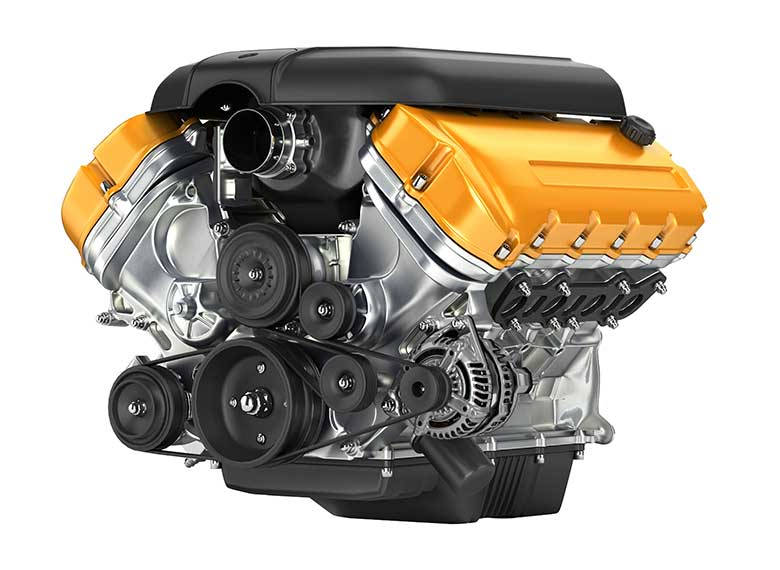

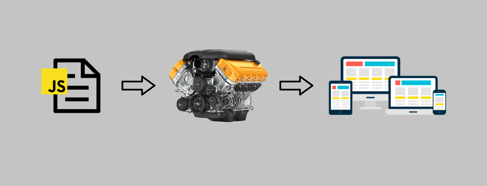

С помощью JavaScript движка, компьютер может прочитать и понять javascript файл. JavaScript движок - это переводчик, который переводит то, что мы написали в javascript файле на язык, понятный компьютеру. Получается, движок берет наш js файл, читает его, и потом переводит его в единицы и нули, и отдает компьютеру. Компьютер теперь сможет понять, что написано в js файле.

JavaScript движок понимает язык JS.

Существует несколько JavaScript движков, Google в своем браузере Google Chrome использует V8 engine. Так же V8 engine использует Node.js

Сам V8 движок написан на C++

<hr />
Попробуйте ответить, что такое JavaScript Engine и для чего он нужен?

<details>
<summary>Ответ:</summary>

JavaScript Engine - это такая программа, переводчик, который переводит код, который мы написали на JavaScript, в язык нулей и единиц, понятный компьютеру. JavaScript движок нужен для того, чтобы компьютер сумел понять, что мы от него хотим, что мы написали в javascript файле.

</details>

<hr />

Хорошо, мы разобрались, зачем нужен JavaScript движок. А что происходит внутри этого движка, внутри этой волшебной машины, которая понимает язык JavaScript?

### Что происходит внутри JavaScript движка?

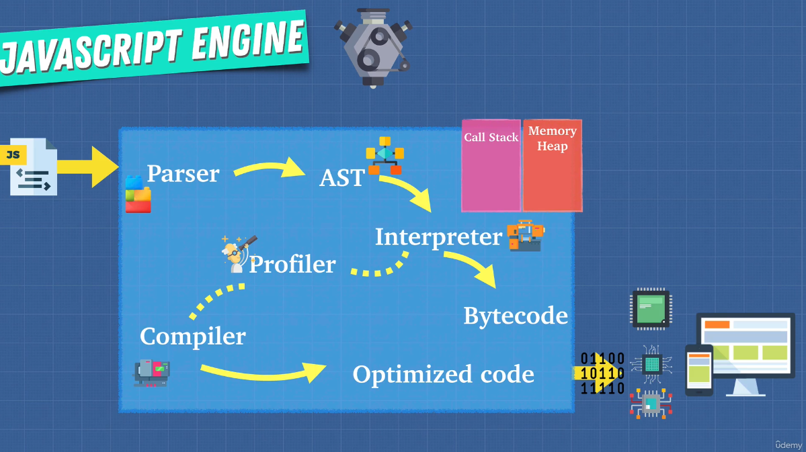

- мы даем движку наш javascript файл
- движок начинает выполнять парсинг этого файла, он же лексический анализ

<details>
<summary>что такое парсинг? 
</summary>

**Есливычитаетеэтоттекстскореевсеговыпойметечтотутнаписано**

Ну как, сумели прочитать эту строку? Если сумели, то вот то что сейчас сделал ваш мозг, и есть парсинг. Мозг произвел парсинг этой длинной строки, он разбил эту строку на отдельные слова, затем он присвоил значение этим словам и сформировал законченное предложение.

В случае с компьютером, парсинг работает точно также.

</details>

парсинг состоит из двух этапов:

- сначала **[сканер](https://github.com/v8/v8/blob/master/src/parsing/scanner.h)** берет javascript файл, читает его, и раскладывает код, который мы там написали, на распознанные группы. Каждая такая группа символов из javascript файла называется токеном. Токен - это идентифицированная сканером последовательность символов, подобно группировке букв в словах. Короче говоря сканер читает наш javascript файл, как человек, находит там знакомые слова, и узнает их. Когда сканер читает javascript файл, он сравнивает содержимое файла с [таблицей](https://github.com/v8/v8/blob/master/src/parsing/keywords.txt) которая имеет такой вид:

```txt file=v8/src/parsing/keywords.txt
async, Token::ASYNC
await, Token::AWAIT
break, Token::BREAK
case, Token::CASE
catch, Token::CATCH
class, Token::CLASS
const, Token::CONST
continue, Token::CONTINUE
debugger, Token::DEBUGGER
default, Token::DEFAULT
delete, Token::DELETE
do, Token::DO
else, Token::ELSE
```

сканер читает файл и видит знакомые слова, и когда сканер узнал слово, он присваивает ему токен.

- затем в дело вступает сам парсер, он берет токены, которые нашел сканер, и создает **AST (Abstract Syntax Tree, Абстрактное синтаксическое дерево)**.<br />
  AST - это такое дерево, которое внешне представляет наш код, который мы написали в файле javascript. Каждый узел этого дерева обозначает какой нибудь кусочек кода.

Сейчас будет пример того, как выглядит Абстрактное синтаксическое дерево, построенное вот из этой маленькой функции:

```js
function myLittleFunction() {
  var a = 1
  return a
}
```

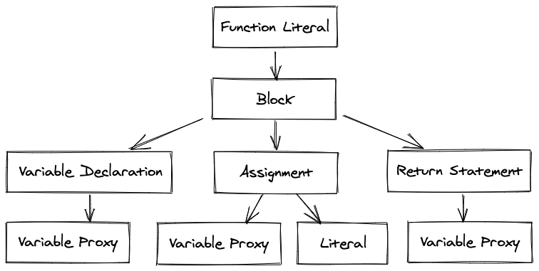

можно еще пойти на сайт [astexplorer.net](https://astexplorer.net/) и посмотреть как выглядит это дерево в виде кода, а выглядит оно так:

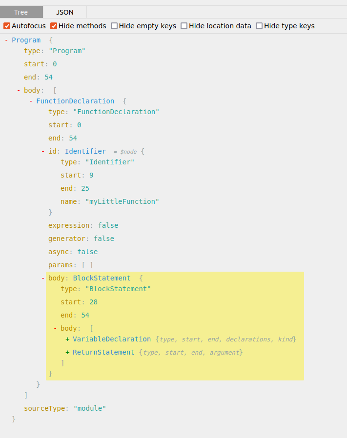

С помощью этого Абстрактного синтаксического дерева JavaScript движок может теперь наконец понять, что происходит в коде javascript файла. Парсер прочитал javascript файл, построил вот это AST дерево, движок посмотрел на это дерево, и ему стало понятно, что это за код мы написали.

- теперь AST дерево попадает к **Интерпретатору**. <br />
  движок V8 использует интерпретатор который называется [Ignition(зажигание)](https://github.com/v8/v8/blob/master/src/interpreter/interpreter.h).<br />
  Что делает интерпретатор? Он берет Абстрактное синтаксическое дерево, и превращает его в **байт код**

сделаем пока что паузу и поговорим про Интерпретаторы и Компиляторы

## Интерпретаторы и Компиляторы

В программировании есть два основных пути перевода исходного кода в машинный код который будет понятен компьютеру:

- при помощи интерпретатора
- при помощи компилятора

Начнем с Интерпретатора.


Что такое интерпретатор? Интерпретатор - это программа-переводчик, которая переводит код, который мы написали в редакторе, в другой код, который понятен компьютеру.

Вот вам такой пример:

Я говорю по-английски, а мой друг говорит по-испански. Чтобы нам поговорить друг с другом, мы нанимаем переводчика(Интерпретатора). <br />
Как работает интерпретатор?

- Я говорю одно предложение на английском.
- Интерпретатор переводит это предложение на испанский, и мой друг меня теперь понимает.
- Теперь я говорю следующее предложение, интерпретатор переводит его, и мой друг понимает что я сказал.

Вот так, предложение за предложением, происходит наше общение.

Интерпретатор читает код, который мы написали в редакторе по одной строке, строка за строкой, построчно. Перевод исходного кода в другой код, понятный компьютеру, идет на лету, строка за строкой.

Теперь поговорим про **компилятор**.

Что такое компилятор? Компилятор - это тоже программа-переводчик, как и интерпретатор, но работает она по-другому.

Вот пример:

Я говорю по-английски, а мой друг говорит по-испански. Чтобы нам поговорить друг с другом, мы теперь наняли другого переводчика(Компилятора). <br />
Как работает компилятор?

- я пишу на листе бумаги все что я хочу сказать своему другу, исписываю весь лист целиком и отдаю его компилятору
- компилятор теперь переводит все что я написал, **сразу**, а не по одной строке, и отдает моему другу. Мой друг теперь понимает, что я хочу ему сказать.

Видите разницу? Интерпретатор переводит то, что я написал своему другу по одной строке, на лету, **построчно**. А компилятор берет **весь текст**, который я написал, потом весь этот текст переводит, и только потом отдает моему другу. <br />
Как думаете, кто из них быстрее, интерпретатор или компилятор?

**Быстрее компилятор**. Знаете почему? Потому что когда работает интерпретатор, он читает код по одной строке переводит его, потом отдает его компьютеру. Потом читает новую строку, переводит ее, отдает ее компьютеру. Вот так это все продолжается раз за разом, строка за строкой.

А как работает компилятор? Он берет вообще весь код который мы написали, сразу же его весь переводит, и отдает компьютеру. Это быстрее, но проблема в том, что мы не можем теперь общаться на лету. Если я хочу сказать что то новое, мне надо сначала отредактировать текст, который я написал, и отдать его компилятору для перевода.

Подведем небольшой итог:

Интерпретатор берет JavaScript код который мы написали, и переводит его построчно в машинный код, на лету, on the fly. <br />
Компилятор берет JavaScript код который мы написали, и переводит его в машинный код за один проход, целиком.
Оба этих подхода переводят JavaScript код который мы написали, в машинный код.

JavaScript можно пропускать или через интерпретатор или через компилятор.
В чем же разница, что выбрать для чтения и перевода кода в JavaScript?

В чем плюс интерпретатора? В том что он переводит javascript код на лету. Мы загружаем javascript файл с сервера в наш браузер, и мы хотим чтобы этот javascript файл запустился сразу же, чтобы мы смогли начать взаимодействовать со страницей сайта, с самим сайтом, нажимать кнопки, совершать разные действия. Поэтому это идеальная ситуация для того, чтобы использовать интерпретатор, и изначально JavaScript как раз и использовал интерпретатор.

Но у интерпретатора есть и минусы.

Смотрите пример ниже:

```js
function someCalculation(x, y) {
  return x + y
}

for (let i = 0; i < 1000; i++) {
  someCalculation(5, 4)
}
```

Тут у нас функция someCalculation(), которая выполняет сложение x + y, ниже у нас for loop, который совершает вызов функции сложения тысячу раз. Обратите внимание, что это одна и та же операция.

И вот это как раз та ситуация, в которой интерпретатору придется тяжело. Интерпретатор немного туповат, он читает код как есть, строка за строкой, не выполняя никаких оптимизаций. Поэтому код начнет выполняться все медленнее и медленнее.

А вот компилятор здесь был бы кстати. Смотрите как этот код обработает компилятор: сначала компилятору нужно немного больше времени, чтобы перевести этот код в машинный код. Сначала происходит процесс компиляции исходного кода. Во время компиляции, компилятор пробегается по всему коду, анализирует его, видит что у нас здесь for loop, который раз за разом выполняет одну и ту же операцию, и во время перевода нашего исходного кода в машинный код, компилятор упрощает исходный код, он видит что у функции someCalculation(5, 4) в for loop одни и те же инпуты, и наша функция всегда возвращает одно и тоже, x + y. Поэтому компилятор понимает, что он может не вызывать функцию someCalculation(5, 4) раз за разом, тысячу раз, он просто меняет вызов этой функции в for loop на девятку. И прогоняет цикл 1000 раз, не вызывая функцию someCalculation(5, 4) раз за разом, вместо этого он вместо функции просто подставляет девятку!

```js highlights=6
function someCalculation(x, y) {
  return x + y
}

for (let i = 0; i < 1000; i++) {
  9
}
```

Вот потому что компилятор не будет теперь в отличие от интерпретатора выполнять функцию someCalculation(5, 4) раз за разом, тысячу раз, заменив ее на девятку, машинный код, который сгенерирует компилятор, будет исполняться быстрее! <br />
То что сейчас сделал компилятор называется оптимизацией кода.

Так вот, вернемся к вопросу о том, что же лучше, интерпретатор или компилятор?
Можем ли мы как то использовать лучшие качества интерпретатора и компилятора?

Инженеры в Google придумали как это сделать. Они объединили интерпретатор и компилятор и назвали это JIT компилятор. (Just-in-Time compiler), компиляция «точно в нужное время». JIT-компиляция - это технология, позволяющая компилировать байт-код в машинный код непосредственно во время работы программы. Таким образом достигается высокая скорость выполнения по сравнению с интерпретируемым байт-кодом.

Давайте посмотрим как работает движок V8, который использует лучшее от интерпретатора и компилятора.


- Сначала мы даем движку наш javascript файл.
- Парсер читает javascript файл и превращает его в Абстрактное синтаксическое дерево.
- затем код в виде AST, изначально попадет к интерпретатору. В V8 интерпретатор называется [Ignition](https://github.com/v8/v8/blob/master/src/interpreter/interpreter.h) (Зажигание)
- Интерпретатор берет Абстрактное синтаксическое дерево и превращает его в байт-код.

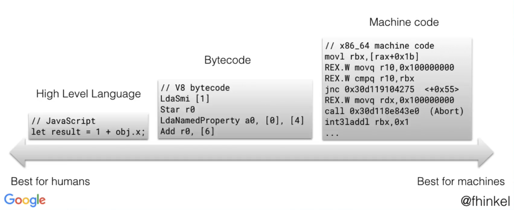

- байт-код является промежуточным слоем между языком высокого уровня (JavaScript) и языком низкого уровня, каким является машинный код
- далее Profiler анализирует байт-код и думает, как его можно оптимизировать.
- если какие то части кода исполняются несколько раз подряд, Profiler передает эти части JIT компилятору.

Profiler говорит JIT компилятору, "Эй, посмотри сюда! Держи вот этот код, его можно оптимизировать".
В википедии есть хорошее определение профайлера:
Профилирование — сбор характеристик работы программы, таких как время выполнения отдельных фрагментов, число верно предсказанных условных переходов, число кэш-промахов и т. д. Инструмент, используемый для анализа работы, называют профилировщиком или профайлером (англ. profiler). Обычно выполняется совместно с оптимизацией программы.

- JIT компилятор берет код от Profiler, в то время как наше javascript приложение исполняется, и комплирует этот код.
- далее JIT компилятор берет и заменяет секции байт-кода, которые можно оптимизировать на улучшенный машинный код.
- с этой точки используется уже вот этот оптимизированный машинный код, в отличие от более медленного, байт-кода

Этот процесс интерпретации, оптимизации и компиляции происходит непрерывно, поэтому скорость выполнения JavaScript не падает и поддерживается на хорошем уровне. Profiler и JIT компилятор работают в паре и постоянно обновляют и оптимизируют байт-код, чтобы он был как можно более эффективным.
Интерпретатор позволяет нам исполнять код сразу же, а JIT компилятор и профайлер позволяют нам оптимизировать этот код во время исполнения программы.

Компилятор в V8 называется [Turbofan](https://github.com/v8/v8/tree/master/src/compiler)

Ну ладно, с интерпретатором и компилятором мы разобрались. А зачем нам вообще надо было все это знать? Мы же можем просто писать JavaScript код не думая обо всех этих деталях, о том, как там работает этот V8 движок. Зачем нам эта информация?

Нам стоит знать как работает JavaScript движок для того, чтобы мы могли писать более оптимизированный код, который компилятор может сразу получить и исполнять нашу программу быстрее. Еще мы можем писать такой код, который не будет сбивать с толку компилятор, потому что компилятор может делать ошибки и пытаться оптимизировать код, который и не надо было вообще оптимизировать. Если компилятор делает ошибку, и происходит что то неожиданное, компилятору приходится делать **деоптимизацию**, и этот процесс занимает еще какое то время.

В будущем мы научимся писать более оптимизированный код помогая профайлеру и компилятору, используя полученные о работе движка знания.

Давайте сделаем небольшое отступление от JavaScript и посмотрим, как работают другие языки программирования.

В Windows вы наверное видели файлы с расширением .exe. Чтобы запустить такой файл, нам нужно кликнуть по нему два раза, и приложение запустится. В большинстве случаев программы с расширением .exe написаны на C++. Сначала мы пишем код на C++, затем компилируем его, и получаем .exe файл.

Пример того, как можно скомпилировать C++ код:

```bash
$ g++ your_program.cpp -o your_program
```

Здесь мы компилируем your_program.cpp в your_program.exe. Затем мы можем запустить скомпилированную your_program.exe

Java к примеру, работает по другому. У Java есть штука под названием JVM - Java Virtual Machine. JVM компилирует, или интерпретирует исходный код в байт-код внутри Java приложения. JVM понимает байт-код. То есть в отличие от языков программирования, таких как C++, которые должны быть скомпилированы под каждый тип компьютера, программа Java должна быть скомпилирована в байт-код только один раз, и этот байт-код будет понятен виртуальной машине Java. Вот исходя из этого принципа и появился слоган Java, "write once, run everywhere".


Нужно отметить тот факт, что байт-код - это не машинный код. Большинство компьютеров не понимают байт-код. Компьютеры понимают машинный код, но не байт-код. Чтобы компьютер понял байт-код, нам нужна виртуальная машина, или JavaScript движок, который будет выполнять байт-код.
Нельзя взять, два раза кликнуть по файлу с байт-кодом, и запустить этот код без движка.

Вот вам теперь вопрос, как думаете, JavaScript, это интерпетируемый язык?
Изначально JavaScript был интерпретируемым языком, когда он только появился. Первый движок, Spider Monkey, который сделал Brendan Eich, интерпретировал JavaScript в байт-код.
Но со временем это положение вещей изменилось. У нас появились компиляторы, которые позволяют оптимизировать код. В наше время JavaScript - это отчасти интерпретируемый язык, но все зависит от имплементации.

Хороший пример - это Python. Питон может быть скомпилирован, а может быть интерпретирован. Питон может даже быть интепретирован через виртуальную машину Java, так что все зависит от имплементации.
В случае с JavaScript все точно так же зависит от имплементации, поэтому говорить что JavaScript - это интерпретируемый язык, не совсем верно.

Окей. Так вот, к вопросу о том, зачем мы все это учили. Учили мы это все для того, чтобы понимать, как писать код так, чтобы помогать компилятору его оптимизировать.
К тому как именно это делать, мы еще вернемся, а сейчас поговорим про такую вещь как Call Stack (Стек Вызовов)

## Call Stack (Стек Вызовов)

Что же это за штука такая, Стек вызовов? Штука эта очень полезна, и нужна для дебагинга нашего кода, а про то, что это такое, сейчас поговорим.
Можно представить себе, что это такой todo list вызовов функций. Дело в том, что JavaScript является однопоточным. Это значит что в каждый момент времени JavaScript может выполнять только одну задачу. Поэтому у него есть только один Call Stack.

Представьте что у нас есть какая то программа. Последняя строка этой программы - это вызов функции. Вызов этой последней функции может привести к вызову еще каких то 5 функций, и эти пять функций в свою очередь могут привести к каскаду вызовов еще каких то функций, при этом функции могут ждать результата работы друг друга, и так все это будет продолжаться, пока не закончится работа нашей конечной функции.

JavaScript может делать только одну вещь в данный момент. Это однопоточный язык. Поэтому JavaScript должен вести какую то историю операций, своего рода todo list того, что ожидает возврата, какие функции были вызваны, но еще не закончили свою работу. Вот это и есть Call Stack. Это структура данных, которая удерживает эту информацию, это такой todo list.

Этот стек работает по принципу, Last in, First out. Работа стека похожа на стопку книг:


- Если мы хотим добавить книгу в стек, мы добавляем ее сверху. Мы не пихаем ее вниз или в середину.
- Если мы хотим убрать книгу из стека, мы убираем ее сверху.

То есть получается, что последняя книга, которая была добавлена, первая же и уйдет. (Last In, First Out).
Давайте посмотрим на то, как это будет работать в случае с вызовами функций.


- мы вызваем функцию main, и Стек Вызовов берет это себе на заметку и добавляет ее в стек.

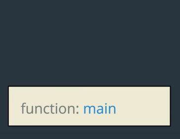

- функция main вызывает другую функцию, multiply

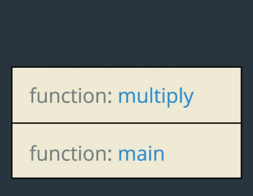

- функция multiply вызывает функцию something

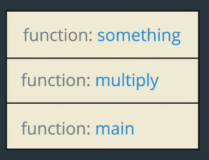

- все эти функции теперь добавились в Call Stack.

Далее, начинается обратный процесс.

- функция something отработала, она была добавлена в Стек Вызовов последней, поэтому она же первая и уйдет оттуда.


- затем уходит функция multiply


- затем из стека вызовов уходит функция main


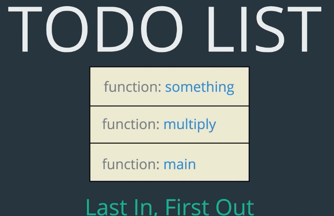

Картинки со стеком и анимация взяты из видео Colt Steele, [(The JS Call Stack Explained In 9 Minutes)](https://www.youtube.com/watch?v=W8AeMrVtFLY)

Подведем итог по работе Стека Вызовов:

- когда мы вызываем функцию, детали о ее вызове сохраняются в начале Стека Вызовов. (pushed to the top of a Call Stack)
- когда функция возвращает результат, информация о ее вызове убирается из Стека Вызовов. (popped off the top of a Call Stack)

Сейчас посмотрим, как Стек Вызовов работает на реальном примере.

```js highlights=5
function multiply(x, y) {
  return x * y
}

const res = multiply(3, 5)
```

- у нас есть функция multiply, и в последней строке программы мы ее вызываем. Это главная функция, она у нас на самом верхнем уровне нашей программы. Такие функции называются главными функциями, (Main functions). Такая вот главная функция, top-level function есть в любом javascript файле.
- далее эта функция самого верхнего уровня добавляется в Стек Вызовов, и указывается что она вызывается на 5 строке:

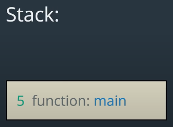

> обратите внимание, что Стек игнорирует строки где мы _объявляем функцию multiply_. Объявление и вызов функции - это разные вещи. В Стек добавляются только вызовы функций.

- далее в main function мы вызываем функцию multiply (multiply(3,5)). Это значит, что мы должны добавить новый фрейм в Стек Вызовов, на самый его верх:

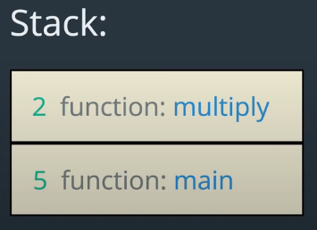

- функция multiply отрабатывает, и на второй строке возвращает результат умножения x на y (return x \* y)
- после того как функция multiply вернула результат, она удаляется из Стека вызовов.


- теперь наша main function так же отработала, и удаляется из Стека Вызовов:

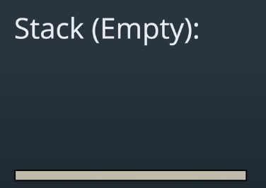

Пара слов о Stack Frames.

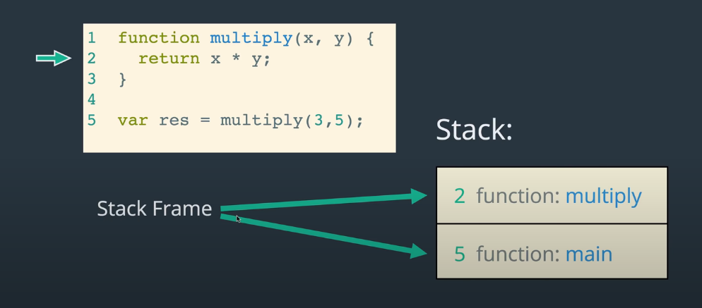

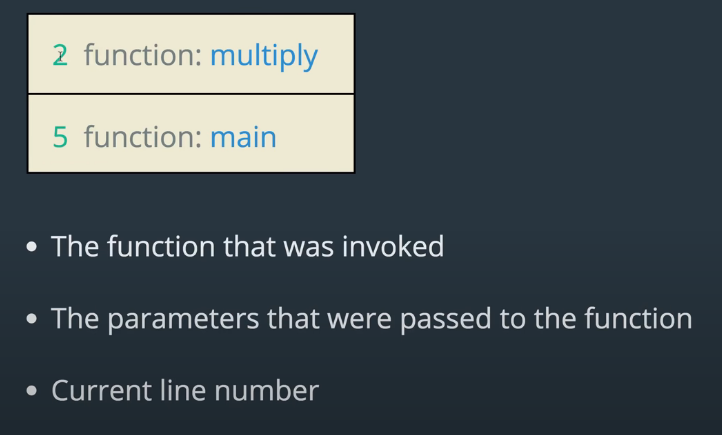

Фреймы в Стеке содержат информацию о вызовах функций:

- имя функции, которая была вызвана, например multiply
- параметры, которые были переданы функции
- номер строки

**Для демонстрации работы Call Stack в Google Debugger Tools смотрите видео Colt Steele: The JS Call Stack Explained In 9 Minutes**

`youtube: https://www.youtube.com/watch?v=W8AeMrVtFLY`

Подведем итог по Call Stack:

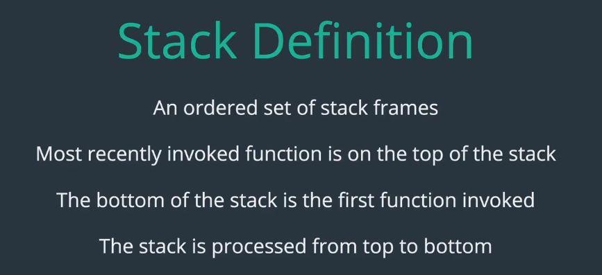

- Стек Вызовов - это упорядоченный список фреймов. Это просто такой todo list вызовов функций.
- Те функции, которые были вызваны последними, находятся наверху этого стека
- Самая первая функция, которая была вызвана, находится в самом низу стека
- Стек обрабатывается сверху вниз

[вот еще заметка про Стек Вызовов на MDN](https://developer.mozilla.org/en-US/docs/Glossary/Call_stack)

Поговорим теперь про Garbage Collection в JavaScript

## Garbage Collection (Сборка мусора)

В JavaScript есть сборка мусора. Что это значит?

Вот есть у нас функция, внутри которой мы создаем объект. Этот объект будет теперь храниться в Memory Heap (в куче памяти). JavaScript автоматически поместит этот объект в Memory Heap. <br />
Когда функция заканчивает выполнение, и этот объект становится нам больше не нужен, JavaScript почистит память, которую мы больше не используем. Это называется Сборкой мусора.

Иногда при сборке мусора возникают ошибки, и память не освобождается. В JavaScript происходит автоматическая сборка мусора, но в таких языках программирования низкого уровня, как C, мы сами осуществляем сборку мусора, вручную. Мы контролируем сборку мусора сами, поэтому программы на C очень быстрые и эффективно используют память, потому что никаких хвостов в памяти не остается, как при автоматической сборке мусора.

Как работает сборка мусора? Вот есть у нас такой код:

```js
var person = {
  firstName: "Gregor",
  lastName: "Jesf",
}
```

Теперь мы говорим к примеру, что person = 5. firstName и lastName все еще в Memory Heap, но они нам больше не нужны, так как на них уже больше никто не ссылается, потому что объект person уже не объект, а число 5. Garbage Collector теперь пометит эти хвосты как мусор, и удалит их из памяти.

```js highlights=1-3
var person = {
  firstName: "Gregor",
  lastName: "Jesf",
}

person = 5
```

Так же происходит и со Стеком Вызовов: когда функция выполнена, она удаляется из Стека, и Сборщик Мусора помечает ее как мусор, и удаляет ее из памяти.
